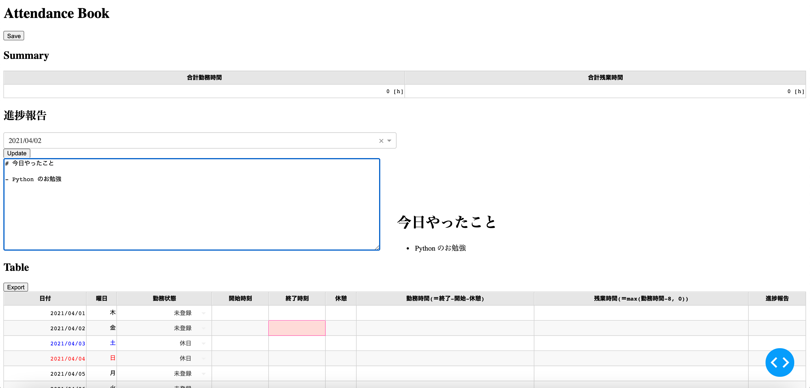

# How to use

- We will assume you can handle [Poetry](https://python-poetry.org/). See https://python-poetry.org/docs/#installation to install it.

```
$ poetry install
$ poetry run python3 app.py
```

- Then open your web browser and go to http://127.0.0.1:8050/ . One may get the following result:


